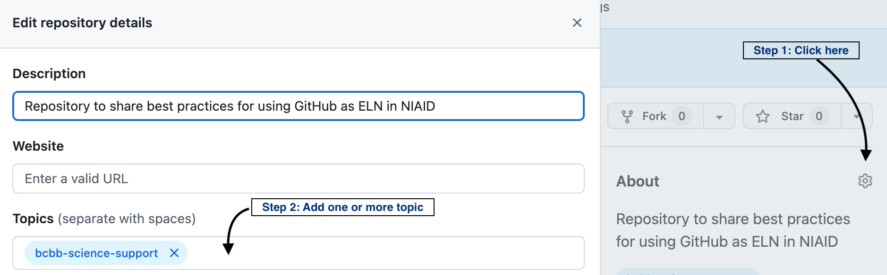

### Best Practices for BCBB Collaboration on Github
---
#### Purpose of this repository

This repository will serve as demo and list of guidelines for learning best practices of using [github.com/niaid](http://github.com/niaid/) for all collaboration activities.

---
#### Content
- [1) Create a repo](#create-a-repo)
- [2) Repository Naming Convention](#repository-naming-convention)
- [3) Required GitHub topic tags](#required-github-topic-tags)
- [4) Project Organization](#project-organization)
- [5) Project Notes](#project-notes)
- [6) Other Useful Suggestions (Optional)](#other-useful-suggestions-optional)
- [7) Tips: Incorporating GitHub into your Daily Workflow](tips-incorporating-github-into-your-daily-workflow)
- (8) Add yourself to the BCBB group on NIAID Github (#bcbb-group)

_____________________
#### Create a Repo
Create a new repo for your new collaboration.  Either choose to make your repo "internal", visible to anyone in NIAID or keep the repo "private" to a specific group such as 'bcbb'.  By default, it will be visible to anyone in NIAID as an "Internal Repository".  See this [quickstart tutorial](https://docs.github.com/en/repositories/creating-and-managing-repositories/quickstart-for-repositories) for creating a repo. Edit the README.MD file to describe your project and include important information such as PI, Project TItle, and the [BRADS](https://requests.bioinformatics.niaid.nih.gov/account/user/dashboard) issue number.
- Other resources to learn more on GitHub are: [git-scm](https://git-scm.com/book/en/v2/Getting-Started-About-Version-Control) and [git-carpentry](https://swcarpentry.github.io/git-novice/).

- Public repository: To request the repo to be public, complete this form (NIH VPN required) - [Make repo public](https://requests.bioinformatics.niaid.nih.gov/request/newRequest/129b0a9a-62ff-4bd5-801c-7f0c2040b73d/request?sectionId=19&sectionRequestTypeId=23)
- Internal repository: Members of any organization belonging to National Institute of Allergy and Infectious Diseases will be able to see this repository
- Private repository: Only you and any other invited collaborators can view the repository.

If you create the repository under NIAID Github, you will be made administrator by default. If you transfer a personal repository to NIAID Github, you will then need to request administrator privileges from ScienceApps@nih.gov (aka, Mike Dolan).

#### Create a Repo starting from an existing Template.
- Start from an existing Template on GitHub. By using a template, you will get a general folder structure and a sample ".gitignore" file. For example:
  - [bcbb_ELN_project_template](https://github.com/niaid/bcbb_ELN_project_template) — an ELN-style project template.
  - [R_project_template](https://github.com/bluegreen-labs/R_project_template) — a general-purpose R project template.
  
  To use a repo as a template, go to its GitHub page, click the green "Use this template" button in the top-right, and create your repo.  

#### Transferring a Project

To transfer a "personal" project without needing to reach out to Science Apps:

1. Create a new, empty repo in NIAID as described above (don't add any suggested files).
2. Pull your existing repo to a local location.
3. Use `git remote set-url origin {new url from new repo}` to reset the GitHub address.
4. Check to make sure it looks okay `git remote -v`.
5. Then push to the new repository `git push origin main`.

#### View repositories that you have contributed to NIAID
In the NIAID Github, under Repositories, you can select "Contributed by Me" to see the repositories that you have contributed to NIAID. You can also use `contributed-by:@me` in the search bar to find these.


#### Repository Naming Convention
A consistent naming scheme helps to make repos discoverable and self-describing at a glance. A common naming pattern is {PI-or-project}\_{analysis-type}\_{year} or similar. The analysis type could be one of the domain topics listed below.

#### Required GitHub Topic tags
Tag your repo with Topic tags to make repos searchable and filterable across the NIAID organization.  Below are a set of required tags (and optional tags) for all scientific collaboration repositories. 

##### **Required Topics (BCBB)**
As the administrator of your repository, you will able able to tag your repository with one or more topic tags.  Simply go to "About" in the Right side of the page and find the Topics field. (see screenshot)
- bcbb-collaboration
- bcbb-training  (if repository is a training offered. This topic will allow it to be listed in [NIAID Learning Resources](https://niaid.github.io/training/)
 )

##### **Required Topics (Domain) - use one or more**
- AI
- biovisualization
- clinical-genomics
- data-science
- image-analysis
- metagenomics
- microbial-genomics
- phylogenetics
- structural-biology
- transcriptomics

##### **Recommended Topics (optional)**
- pipeline-dev


#### Project Organization
A consistent, self-explanatory directory structure is the foundation of every reproducible project.  Each separate collaboration should have a separate project directory, therefore consider creating a new repository for each new collaboration project.  

**Recommended directory layout:**
```
project/
├── README # overview of the project (Title, Description, Contact Information of Collaborators)
├── CITATION # List relevant publications
├── data/           # Describe data provenance, where it is stored and other details but don't use to store raw large data
├── results/        # output from analyses (dated subdirectories)
├── src/            # source code and scripts
├── doc/            # manuscripts and notes
└── bin/            # compiled binaries or wrapper scripts
```

#### Project Notes
Create markdown files and using a consistent naming format, for example, {date}_{task} , as "2026-07-22_QCpipe.md". Clearly labeling files with a date will keep them organized.

#### Other Useful suggestions (Optional)
- Use [VS Code](https://code.visualstudio.com/) or [Positron](https://positron.posit.co/) as IDE and use GitHub Desktop to update repo
- Use `.gitignore` files if you need to exclude files (e.g. data) from the repo
- Use GitHub Issues to keep track of what is pending to be done or write it as new pages in the doc/ folder.
  - These can be included in a personal `Project` (`https://github.com/{your user name}?tab=projects`) so you can see all of your tasks in one place.
- [Obsidian](https://obsidian.md/) is free note-taking software that operates on Markdown files
- If you need to upload large files, consider using https://git-lfs.com/

#### Tips: Incorporating GitHub into your Daily Workflow

- Commit at regular intervals, especially at the point of a deliverable
- Make a regular (monthly?) calendar event to check the status of your repositories and commit any "ready" code
- If desired, make branches when you want to work on a specific feature but it is still exploratory

#### Getting access to internal NIAID Github
Contact ScienceApps@nih.gov (aka, Mike Dolan) and provide your github username so that it can be associated with the NIAID organization. If you do not have a Github account, create one.

#### Request access to be a member of the BCBB Team on NIAID Github
View the members of the BCBB Team at NIAID Github [here](https://github.com/orgs/niaid/teams/bcbb) and click the button to request to be added to the team.
